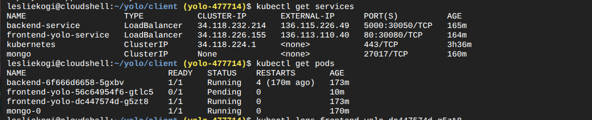

# YOLO App - GKE Deployment

##  Overview
This project demonstrates the deployment of a full-stack YOLO application (frontend, backend, and MongoDB) on Google Kubernetes Engine (GKE). The goal was to apply orchestration concepts using Deployments, Services, and StatefulSets.

##  Live URLs
- Frontend: http://136.113.110.40
- Backend: http://136.115.226.49:5000

##  Components
- **Frontend** → React app deployed as a LoadBalancer service  
- **Backend** → Flask API (LoadBalancer)  
- **Database** → MongoDB StatefulSet with Persistent VolumeClaim

##  Current Status
All pods and services are running on GKE.  
Frontend loads successfully, but currently fails to fetch data from the backend due to a **CORS/network restriction** between external IPs.

##  Debugging Steps Attempted
- Verified all services are exposed via LoadBalancer.  
- Confirmed backend reachable internally (via kubectl exec).  
- Adjusted frontend URLs for backend service.  
- Verified successful builds and container images pushed to Artifact Registry.

## Screenshots
- Screenshot of running pods and services on GKE , confirming sucessful deployment

### Author 
Leslie Kogi